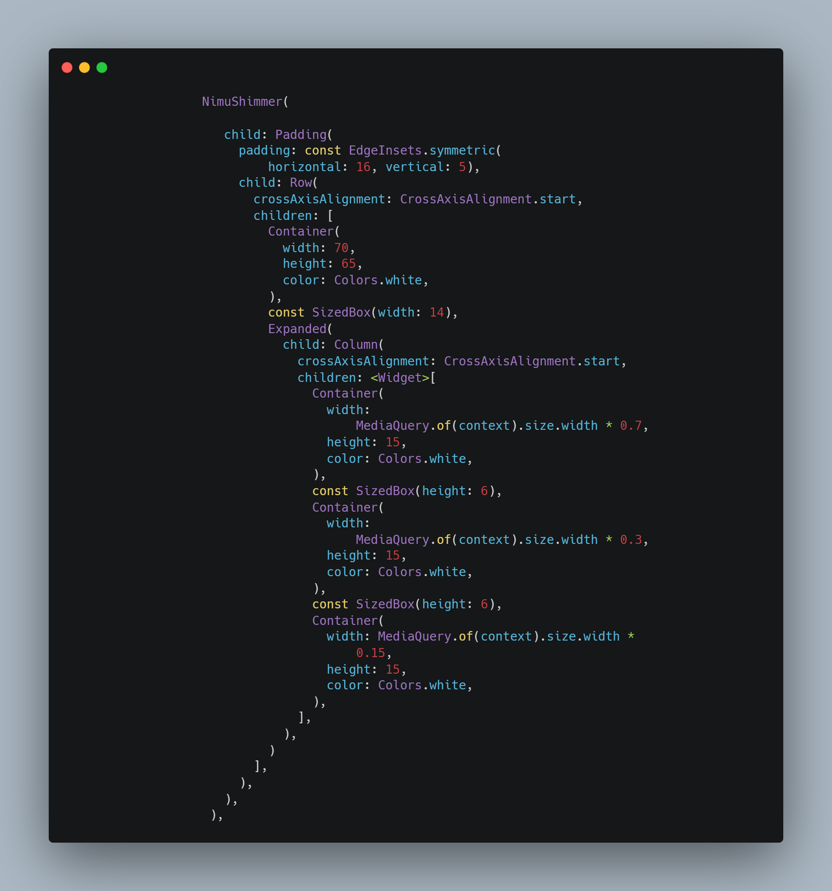

TODO: NimuShimmer is a Flutter Shimmer Effect Widget that can be used by giving Linear Gradient for more visual shimmer effect or just by adding Main Color and Secondary Color for basic shimmer effect.

## Getting started



Codes:

```
               NimuShimmer(
                     
                      child: Padding(
                        padding: const EdgeInsets.symmetric(
                            horizontal: 16, vertical: 5),
                        child: Row(
                          crossAxisAlignment: CrossAxisAlignment.start,
                          children: [
                            Container(
                              width: 70,
                              height: 65,
                              color: Colors.white,
                            ),
                            const SizedBox(width: 14),
                            Expanded(
                              child: Column(
                                crossAxisAlignment: CrossAxisAlignment.start,
                                children: <Widget>[
                                  Container(
                                    width:
                                        MediaQuery.of(context).size.width * 0.7,
                                    height: 15,
                                    color: Colors.white,
                                  ),
                                  const SizedBox(height: 6),
                                  Container(
                                    width:
                                        MediaQuery.of(context).size.width * 0.3,
                                    height: 15,
                                    color: Colors.white,
                                  ),
                                  const SizedBox(height: 6),
                                  Container(
                                    width: MediaQuery.of(context).size.width *
                                        0.15,
                                    height: 15,
                                    color: Colors.white,
                                  ),
                                ],
                              ),
                            )
                          ],
                        ),
                      ),
                    ),
```

## Usage

TODO: You can find example in `/example` folder.
